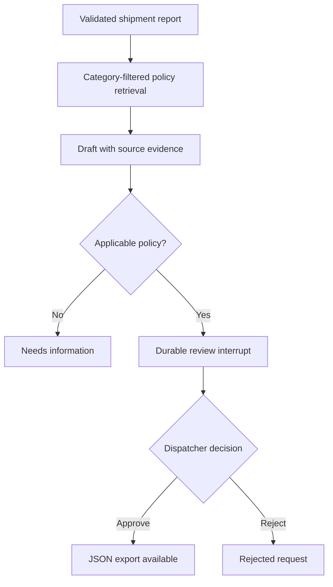
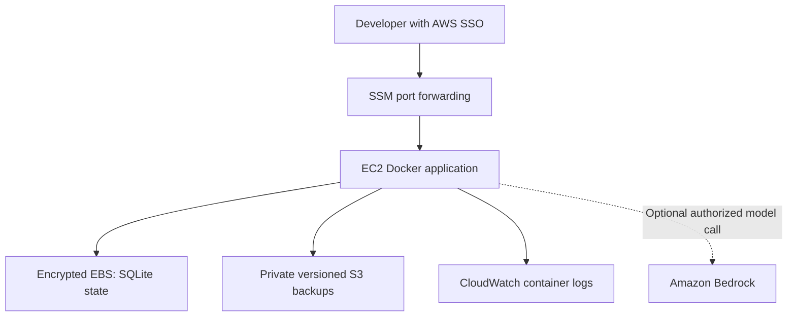

# Architecture and decisions

## Application workflow

LangChain handles document records, the retrieval runnable, chat prompt and output parser. LangGraph owns state transitions and the review interrupt. The reviewer is outside the model; the draft cannot call review or export endpoints. API authentication covers all request, review and export routes. `/health` is public and contains no shipment data.

`requests.sqlite` stores references and immutable input. `checkpoints.sqlite` stores LangGraph state, including evidence, drafts and decisions. Repeating a reference with the same payload retrieves the existing request or resumes a failed node. A different payload returns a conflict. A process lock serializes creation and decisions. This supports one process, not distributed replicas.

The model runs only in Bedrock mode. Demo mode copies verified report text and the applicable sample procedure; it is deliberately reproducible and is not an LLM simulation. Model drafts are untrusted and review is mandatory. Prompt instructions discourage injection, but are not a guarantee against it. No action tools or arbitrary URL fetchers are exposed.

## AWS learning deployment

The stack creates a dedicated VPC, one subnet, an internet gateway, outbound-only security group, instance role, encrypted root volume, S3 bucket and CloudWatch resources. The instance has an internet-routable address for outbound package downloads and SSM connectivity, but no inbound security-group rules. Public IPv4, compute, EBS, S3 and logging may incur charges. No NAT gateway or load balancer is provisioned.

The instance role permits SSM, backup objects under `backups/` and the application's log stream. Bedrock access is intentionally not granted by this template: add the selected model's scoped invocation permission after deciding to enable model billing. No static AWS keys are needed.

## Tradeoffs to explain in an interview

- Category-filtered BM25 is inspectable and adequate for three small policies. Add dense retrieval only when retrieval evaluation shows a concrete recall problem.
- SQLite keeps the lab understandable and inexpensive. More workers require a shared production checkpointer, a transaction-safe application database and concurrency tests.
- Human review avoids silently turning an uncertain draft into a customer commitment. It does not prove the review itself is correct.
- ECS/Fargate is a later migration exercise. Kubernetes is outside this four-week foundation.
- The application currently provides traces in persisted state, not a full tracing platform or latency/token dashboards.
